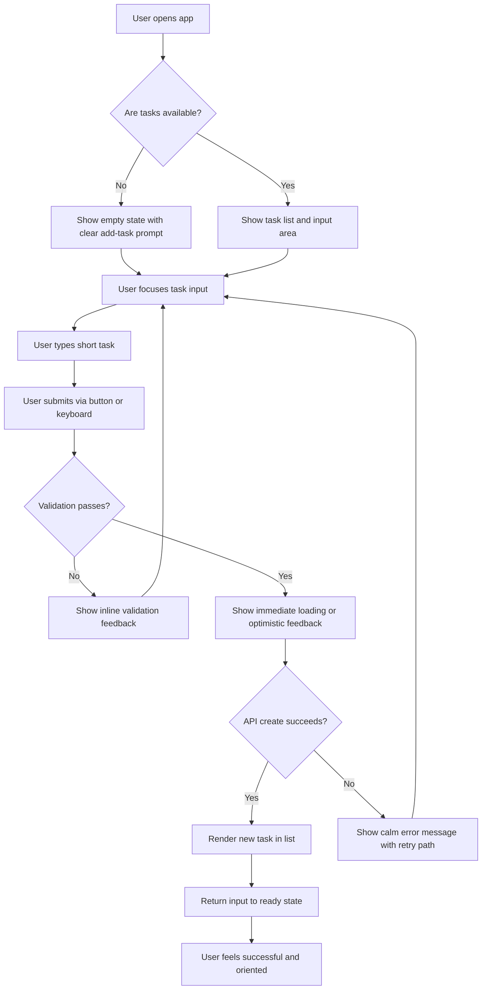
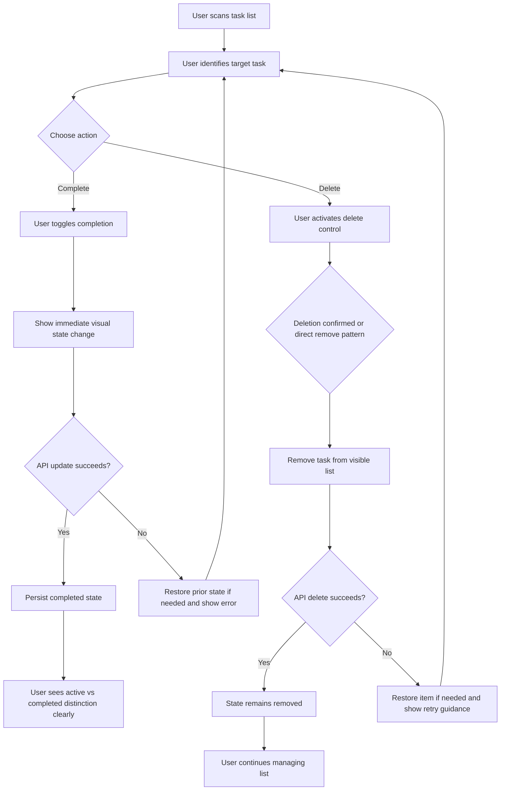
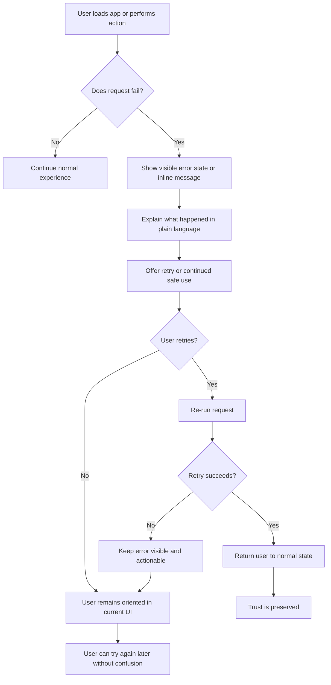

---
stepsCompleted:
  - 1
  - 2
  - 3
  - 4
  - 5
  - 6
  - 7
  - 8
  - 9
  - 10
  - 11
  - 12
  - 13
  - 14
inputDocuments:
  - '_bmad-output/planning-artifacts/prd.md'
  - '_bmad-output/planning-artifacts/project-brief.md'
  - '_bmad-output/planning-artifacts/architecture.md'
lastStep: 14
status: complete
completedAt: '2026-03-22'
---

# UX Design Specification bmad-todo-app

**Author:** Marco
**Date:** 2026-03-22

---

<!-- UX design content will be appended sequentially through collaborative workflow steps -->

## Executive Summary

### Project Vision

bmad-todo is a minimal, trustworthy personal task list for the web. Its UX goal is not feature richness, but dependable clarity: users should be able to open the app, capture a task, update its state, remove it when done, and trust that the list will still be correct after reload. The design should feel calm, direct, and frictionless, avoiding both enterprise heaviness and demo-grade thinness.

### Target Users

The primary users are individual people working alone in the browser, including knowledge workers, students, and developers who want a lightweight place to track tasks without signing up. They value speed, predictability, and clear feedback more than advanced organization features. The product must be usable on both mobile and desktop, with no instruction required for the core loop.

### Key Design Challenges

The UX must make a very small feature set feel complete and dependable rather than bare. It must clearly distinguish active and completed tasks, support fast task entry on small and large screens, and present empty, loading, and error states as first-class parts of the experience. It must also communicate failures visibly without overwhelming the user or breaking flow.

### Design Opportunities

The product can stand out through disciplined simplicity: a capture flow that feels immediate, task states that are visually unmistakable, and microcopy that is calm and helpful rather than technical. Because the scope is intentionally narrow, strong UX execution in the core states can become the product’s main differentiator.

## Core User Experience

### Defining Experience

The defining experience of bmad-todo-app is a fast, low-friction task loop: open the app, understand the current state immediately, add a task, update it confidently, and move on without cognitive drag. The value of the product is not in advanced features but in how little effort it takes to complete the core loop while still feeling dependable and complete.

### Platform Strategy

bmad-todo-app is a responsive web product designed for both desktop and mobile use. It must support touch and mouse/keyboard interaction equally well, with accessible controls and readable states from 320px upward. The experience is online-first for v1, with no offline requirement, and should optimize for fast perceived responsiveness rather than dense multi-screen navigation.

### Effortless Interactions

The task entry flow should feel immediate and self-evident, with no uncertainty about where to type or what happens after submission. Toggling completion should create instant visual confirmation. Deleting a task should feel clear and controlled. Empty, loading, and error states should preserve user orientation instead of interrupting flow. Across the product, the user should rarely have to stop and think about mechanics.

### Critical Success Moments

The first success moment is adding a task and seeing it appear clearly in the list. The second is marking a task complete and instantly understanding the difference between active and completed work. A major trust moment occurs when the user reloads and finds the same state preserved. A major failure-sensitive moment occurs when the API errors; if the app remains calm, informative, and recoverable, the user continues to trust it.

### Experience Principles

- Immediate clarity over decorative complexity
- Obvious feedback for every user action
- Minimal hesitation in the core task loop
- Reliability expressed through visible UI states
- Calm, direct communication in all system messages

## Desired Emotional Response

### Primary Emotional Goals

The primary emotional goal for bmad-todo-app is calm confidence. Users should feel that the app is dependable, clear, and under control from the first interaction. Supporting feelings include immediacy when entering or updating tasks, clarity when scanning work state, and a small sense of accomplishment when tasks are completed or removed.

### Emotional Journey Mapping

On first arrival, the user should feel immediate orientation and low cognitive load. During the core task loop, the product should feel fast, obvious, and frictionless. After completing or deleting a task, the user should feel light satisfaction rather than interruption or ceremony. On reload, the preserved state should reinforce trust. If something goes wrong, the emotional goal is calm recovery: the user should feel informed and capable of continuing, not blocked or alarmed.

### Micro-Emotions

The most important micro-emotions are confidence, trust, clarity, relief, and accomplishment. These matter more than delight or surprise for this product category. The interface should consistently reduce hesitation, prevent doubt, and reinforce the sense that the user is managing tasks in a stable system.

### Design Implications

To support calm confidence, the interface should use restrained visual hierarchy, clear spacing, visible control states, and direct language. To support immediacy, task creation and state changes should respond quickly and predictably. To support trust, empty, loading, error, and persisted states must all feel intentional rather than incidental. To support accomplishment, completion states should be visually satisfying without becoming celebratory or distracting.

### Emotional Design Principles

- Design for trust before delight
- Make clarity visible at a glance
- Reward progress with subtle satisfaction, not spectacle
- Keep failure states calm, actionable, and non-technical
- Avoid guilt, pressure, or overstimulation in copy and interaction design

## UX Pattern Analysis & Inspiration

### Inspiring Products Analysis

Three products provide useful inspiration for bmad-todo-app. Todoist is a strong reference for visual clarity, information hierarchy, and list scanning. It shows how structured task interfaces can feel calm and legible without looking sparse. Google Keep is a strong reference for low-friction capture, where adding something feels immediate and lightweight rather than formal. Microsoft To Do is a useful reference for familiar, dependable completion flows and approachable list management behavior. Together, these products suggest a direction that balances clarity, speed, and trust.

### Transferable UX Patterns

Several patterns are worth carrying forward. From Todoist, the most transferable pattern is strong list readability through deliberate spacing, clear separation of active and completed states, and obvious primary actions. From Google Keep, the most useful pattern is immediate task entry with minimal ceremony and very low hesitation. From Microsoft To Do, the most valuable pattern is straightforward, familiar task interaction that makes completing or deleting an item feel predictable and safe. For bmad-todo-app, these patterns should be adapted into a smaller, more restrained experience with fewer features and stronger focus on the core loop.

### Anti-Patterns to Avoid

The product should avoid becoming overloaded with planning features, nested task complexity, or enterprise-style density before the core loop is fully polished. It should also avoid note-app ambiguity, where users are unsure whether they are capturing a task or just storing unstructured text. Another anti-pattern to avoid is emotional over-design: excessive celebration, visual noise, or dramatic error handling would conflict with the product’s calm and trustworthy positioning.

### Design Inspiration Strategy

The design strategy for bmad-todo-app is to adopt Todoist’s clarity, Google Keep’s capture ease, and Microsoft To Do’s predictability, while deliberately avoiding the weight and feature sprawl of mature productivity suites. The goal is not to imitate any one product, but to combine proven patterns into a more focused experience: instant understanding on arrival, low-friction task entry, unmistakable state changes, and calm recovery when something goes wrong.

## Design System Foundation

### 1.1 Design System Choice

bmad-todo-app will use a lightweight custom design system built from internal design tokens and a small reusable component layer. The system will be intentionally narrow, covering only the primitives and states required for the MVP experience rather than adopting a large external UI framework.

### Rationale for Selection

This approach best supports the product’s goals of clarity, calmness, and low friction. A large established system would accelerate some implementation, but it would also introduce visual and interaction patterns that are broader and heavier than this product needs. A lightweight internal system provides enough structure for consistency while preserving the visual restraint and focused identity needed for the app’s UX direction.

### Implementation Approach

The design system will begin with core tokens for color, typography, spacing, radius, borders, motion, and state feedback. On top of those tokens, the product will define a minimal set of reusable UI primitives such as buttons, text inputs, status containers, and task-row interaction states. The design system should serve the todo flow directly rather than becoming a broad component platform.

### Customization Strategy

Customization will focus on visual clarity and emotional tone rather than brand complexity. The system should emphasize readable hierarchy, obvious interactive states, accessible contrast, and subtle feedback. Every reusable style decision should reinforce calm confidence, immediate usability, and trust in the product’s state changes.

## 2. Core User Experience

### 2.1 Defining Experience

The defining experience of bmad-todo-app is capturing a task and trusting it instantly. The product should make it feel effortless to move a task from intention into a stable, visible list state. The value is not complexity or advanced organization, but the speed and confidence of that transition.

### 2.2 User Mental Model

Users approach the product as a reliable checklist, not a complex productivity workspace. They want to get a task out of their head quickly, see it land clearly, and act on it with minimal thought. Their expectations are shaped by paper lists and simple digital todo tools: add, see, complete, delete, trust. Confusion is most likely when input, state, or persistence is unclear.

### 2.3 Success Criteria

The core experience succeeds when the task entry path is obvious without instruction, adding a task feels immediate, the new item appears clearly in the right place, completion state is unmistakable, and the interface remains understandable during failure or reload. Users should feel that the system “just works” because every action produces visible and believable feedback.

### 2.4 Novel UX Patterns

The product should rely primarily on established interaction patterns that users already understand: direct text entry, explicit add action, familiar completion controls, and list-based scanning. Innovation should come from refinement rather than novelty. The unique value lies in reduced friction, increased clarity, and calm reliability within a familiar interaction model.

### 2.5 Experience Mechanics

The experience begins with immediate orientation: users see the current list state and a clear place to add a task. They enter a short task and submit it through a visible action path. The system responds with immediate visual confirmation by placing the task in the list. Users can then toggle completion or delete directly from the task row. Each action produces clear feedback, and any failure state preserves orientation with calm, actionable guidance. The interaction feels complete when the user can see and trust the new task state without additional interpretation.

## Visual Design Foundation

### Color System

The color system for bmad-todo-app should feel soft, grounded, and trustworthy rather than bright or hyper-productive. The primary palette should use a deep ink or navy tone for structure and primary text, a warm off-white or soft neutral background for calmness, and a muted teal accent for primary actions and success states. Error states should use a restrained red that communicates clearly without dominating the interface. The palette should support strong visual distinction between active and completed tasks while preserving an overall sense of quiet control.

### Typography System

Typography should feel modern, readable, and understated. The system should use a clean sans-serif family with strong legibility at small sizes and enough personality to avoid feeling generic. Hierarchy should come from size, weight, and spacing rather than decorative styling. Headings should provide confident structure, while body text and task content should remain highly readable and neutral. The type system should support fast scanning, clear task entry, and accessible reading across mobile and desktop.

### Spacing & Layout Foundation

The spacing system should use an 8px base unit to create consistent rhythm across components, states, and layouts. The interface should feel open enough to reduce stress but compact enough to preserve task density and speed. Layout should prioritize a single-column focus with a comfortable reading width on desktop and strong clarity on small screens. Spacing between input, task rows, status states, and actions should emphasize hierarchy without introducing visual noise.

### Accessibility Considerations

The visual foundation must maintain WCAG 2.1 AA contrast across all essential UI states. Interactive elements should have clear focus indicators, and color must never be the only signal for task completion or error status. Typography and spacing choices should preserve readability at small sizes and across common device widths. The system should support touch-friendly targets, obvious state changes, and calm, non-technical status communication.

## Design Direction Decision

### Design Directions Explored

Six directions were explored for bmad-todo-app, ranging from darker high-focus utility to warmer supportive layouts and sharper, more pragmatic MVP expressions. The exploration varied visual weight, layout structure, spacing density, and accent usage while staying within the established calm, trust-oriented visual foundation.

### Chosen Direction

The chosen direction is **Direction 01: Soft Calm**. This direction uses warm neutrals, soft surfaces, restrained accent color, and a highly legible single-column layout. It creates a reassuring and focused interface that supports the core experience of capturing a task and trusting it instantly.

### Design Rationale

Soft Calm best matches the product’s emotional and UX goals. It feels dependable without becoming sterile, minimal without becoming empty, and clear without feeling harsh. The warm neutral base helps the product feel calm and approachable, while the restrained accent system keeps actions and state changes visible but not aggressive. This direction supports the idea that the app is a trustworthy everyday tool rather than a high-pressure productivity system.

### Implementation Approach

Implementation should preserve the softness and restraint of this direction through warm background tones, gentle card surfaces, moderate corner radii, deliberate whitespace, and limited accent emphasis. Interactive states should remain obvious, but motion and color use should stay subtle. The final UI should maintain clear hierarchy, immediate readability, and calm recovery in every system state.

## User Journey Flows

### Journey 1: First Task Capture

This flow defines the first meaningful success moment for the product: a user arrives, understands the interface quickly, enters a task, and sees it become part of the list without ambiguity. The journey must feel immediate, low-friction, and trustworthy.

### Journey 2: Task State Management

This flow covers the everyday maintenance loop: scanning tasks, marking them complete, and removing tasks that are no longer needed. The most important UX requirement is that state changes are unmistakable and feel reliable.

### Journey 3: Failure Recovery and Trust

This flow ensures that failures do not collapse the experience. The goal is not just error visibility, but calm recoverability and preserved orientation.

### Journey Patterns

Several patterns should remain consistent across all flows:

- Clear entry point for the next action
- Immediate visible feedback after user input
- Dedicated empty, loading, success, and error states
- Calm, direct language in recovery paths
- No silent failure for any core CRUD interaction

### Flow Optimization Principles

- Minimize steps between arrival and first successful task creation
- Keep actions visible at the point of use rather than hidden in menus
- Make task-state changes legible at a glance
- Preserve user orientation during failure and retry
- Use familiar interaction patterns so the product requires no learning curve for the MVP

## Component Strategy

### Design System Components

The design system foundation provides the low-level building blocks for bmad-todo-app: color tokens, typography rules, spacing tokens, button styling, text input styling, and shared status messaging patterns. These foundation elements are enough for consistency, but they do not yet cover the product-specific interaction patterns needed for the todo workflow.

The most important reusable foundation components are:
- Primary button
- Secondary or quiet button
- Text input
- Inline status message
- Surface or card container
- Focus and interaction state tokens

These should be reused across the product rather than reimplemented inside feature components.

### Custom Components

### TodoComposer

**Purpose:** Capture a new task quickly and clearly.  
**Usage:** Shown at the top of the main screen in both empty and populated states.  
**Anatomy:** Input field, submit action, optional inline validation or error text.  
**States:** Default, focused, typing, submitting, validation error, request error, disabled.  
**Variants:** Standard inline version; compact version if needed for small screens.  
**Accessibility:** Labeled input, keyboard submission support, visible focus state, inline validation linked to the field.  
**Content Guidelines:** Use direct prompt text and short action labels.  
**Interaction Behavior:** Accepts short task text, submits via button or keyboard, clears on success, preserves content on failure.

### TodoList

**Purpose:** Present the current set of tasks in a scan-friendly structure.  
**Usage:** Main content region for the product.  
**Anatomy:** Ordered or grouped list of task rows, optional section heading or count.  
**States:** Populated, empty, loading, error.  
**Variants:** Standard active list; mixed active/completed list.  
**Accessibility:** Semantic list structure, clear reading order, state announcements where needed.  
**Content Guidelines:** Prioritize readability and state distinction over density.  
**Interaction Behavior:** Renders task rows consistently and transitions cleanly between empty, loading, success, and error states.

### TodoListItem

**Purpose:** Represent a single task and expose task-level actions.  
**Usage:** Repeated within TodoList for each task.  
**Anatomy:** Completion control, task text, timestamp, delete action.  
**States:** Default, hover, focus, completed, updating, deleting, error recovery.  
**Variants:** Active and completed variants; compact mobile-friendly layout.  
**Accessibility:** Keyboard reachable actions, visible focus ring, non-color-only completed state, accessible labels for actions.  
**Content Guidelines:** Keep row content short and visually hierarchical.  
**Interaction Behavior:** Supports completion toggle and deletion directly in-row, with immediate visible feedback.

### TodoEmptyState

**Purpose:** Make the empty list feel intentional and inviting.  
**Usage:** Shown when no tasks exist.  
**Anatomy:** Short message, encouraging prompt, visual relationship to task creation input.  
**States:** Default only, with optional contextual variant after deletion of all tasks.  
**Variants:** First-use empty state; post-clear empty state if needed.  
**Accessibility:** Clear heading/message structure and no reliance on illustration alone.  
**Interaction Behavior:** Directs attention back to task entry.

### TodoLoadingState

**Purpose:** Preserve orientation while task data is loading.  
**Usage:** Initial load and possibly refresh states.  
**Anatomy:** Placeholder rows or soft loading skeletons aligned with the real list structure.  
**States:** Initial loading, refresh loading.  
**Variants:** Full-screen initial load; inline refresh state.  
**Accessibility:** Loading state communicated to assistive tech without overwhelming repetition.  
**Interaction Behavior:** Maintains layout continuity and reduces perceived instability.

### TodoErrorState

**Purpose:** Communicate failures clearly and support recovery.  
**Usage:** Shown on failed list load or major interaction failure.  
**Anatomy:** Clear message, retry action, optional contextual explanation.  
**States:** List-load failure, mutation failure, retry in progress.  
**Variants:** Full-state error and inline operation error.  
**Accessibility:** Error message announced appropriately, retry action keyboard reachable.  
**Content Guidelines:** Use calm, direct, non-technical language.  
**Interaction Behavior:** Keeps users oriented and offers obvious next action.

### Component Implementation Strategy

The implementation should combine shared design-system primitives with a small set of product-specific components. Foundation styling should come from tokens and shared UI rules, while todo-specific behavior should live in focused feature components. Product-specific components should not bypass the shared visual foundation.

All custom components should:
- follow the Soft Calm design direction
- reuse shared tokens and primitive styles
- preserve accessibility in every interactive state
- keep behavior obvious and lightweight
- support the core experience of instant capture and visible trust

### Implementation Roadmap

**Phase 1 - Core Components**
- TodoComposer
- TodoList
- TodoListItem

**Phase 2 - State Components**
- TodoEmptyState
- TodoLoadingState
- TodoErrorState

**Phase 3 - Refinement**
- shared status messaging refinements
- subtle success and transition states
- responsive variants for tight mobile layouts

## UX Consistency Patterns

### Button Hierarchy

Primary actions should be reserved for the main progression point on screen, which in this product is usually task creation or explicit retry. Secondary actions should be visually quieter and used for lower-emphasis tasks. Destructive actions such as delete should never compete visually with the primary path and should be clearly distinguishable without becoming alarming.

**When to Use:** Use primary buttons for add-task and key recovery actions. Use secondary or quiet buttons for lower-priority actions. Use destructive styling only for delete-related actions.
**Visual Design:** Primary buttons use the accent color and clear contrast. Secondary buttons use softer borders or neutral surfaces. Destructive buttons use restrained red accents.
**Behavior:** All buttons show clear hover, focus, pressed, and disabled states.
**Accessibility:** Minimum touch target size, visible keyboard focus, and action labels that are explicit rather than abstract.
**Mobile Considerations:** Primary actions remain thumb-reachable and visually obvious without dominating the layout.

### Feedback Patterns

The interface should always make system state visible. Success feedback should usually be implicit through state change rather than toast-heavy confirmation. Errors should be calm, direct, and actionable. Loading should preserve layout continuity rather than blanking the screen.

**When to Use:** Use inline feedback for input issues and local operation failures. Use dedicated state blocks for full-list empty, loading, or error conditions.
**Visual Design:** Success is communicated through stable task-state updates. Errors use restrained color, plain language, and clear recovery actions. Loading uses skeletons or soft placeholders.
**Behavior:** Feedback appears close to the interaction that caused it and should not disorient the user.
**Accessibility:** Status messages should be announced appropriately and never rely on color alone.
**Mobile Considerations:** Inline feedback should stay readable and not push key controls off-screen unexpectedly.

### Form Patterns

Task input should be immediate, minimal, and self-explanatory. Validation should happen with minimal interruption and preserve user effort when something goes wrong.

**When to Use:** Use a single prominent task-entry field with direct submission support.
**Visual Design:** The input should be clearly dominant near the top of the experience, with concise placeholder or label text.
**Behavior:** Submit by button and keyboard where applicable. Reject empty or oversized input with inline explanation. Preserve typed text on request failure.
**Accessibility:** Proper input labeling, focus management, and validation text associated with the field.
**Mobile Considerations:** Keep the input comfortable for touch and avoid cramped side-by-side controls on narrow screens.

### Navigation Patterns

The MVP should behave like a focused single-screen tool, not a multi-area application. Navigation should therefore be minimal and subordinate to the task flow.

**When to Use:** Use simple structural navigation only if needed for grouping states such as active and completed tasks.
**Visual Design:** Keep navigation lightweight, with no heavy sidebars or dense tab systems in v1.
**Behavior:** Users should always know what the main action is without navigating away from the core loop.
**Accessibility:** Ensure any filter or grouping controls are keyboard reachable and clearly labeled.
**Mobile Considerations:** Navigation controls should collapse into simple segmented or stacked controls if introduced.

### Additional Patterns

**Empty States:** Empty states should feel intentional and encouraging, always pointing back to task creation.
**Loading States:** Loading states should mirror the eventual layout so users maintain orientation.
**Error States:** Error states should explain what happened in plain language and provide a retry path.
**Completed State Pattern:** Completed tasks should remain visible but clearly differentiated through more than color, such as line treatment, contrast shift, and icon state.
**Destructive Action Pattern:** Deletion should feel deliberate and clear, but not heavy or overly ceremonial for simple task cleanup.

## Responsive Design & Accessibility

### Responsive Strategy

bmad-todo-app should use a mobile-first responsive strategy. The product is fundamentally a single-column task experience, so the layout should remain focused rather than expanding into a complex desktop dashboard. On mobile, the design should prioritize immediate task entry, readable task rows, and thumb-friendly controls. On tablet, spacing and touch comfort should remain strong while allowing slightly more breathing room. On desktop, the experience should gain width and visual stability, but not additional complexity. Extra screen space should be used for improved readability and calmer spacing rather than introducing unnecessary panels or dense navigation.

### Breakpoint Strategy

The product should use standard breakpoint ranges aligned with the PRD and the architecture:
- Mobile: 320px to 767px
- Tablet: 768px to 1023px
- Desktop: 1024px and above

The layout should be mobile-first, with progressive enhancement at larger sizes. The key adaptation should be spacing, container width, and action layout rather than structural reorganization. Task creation, task scanning, and recovery states should remain recognizable across all breakpoints.

### Accessibility Strategy

The accessibility target should be WCAG 2.1 AA, which is already aligned with the PRD. Accessibility is not a refinement for later; it is part of the product’s trust model.

Key requirements:
- Text and UI contrast must meet AA thresholds
- Keyboard navigation must support all core interactions
- Focus indicators must be clearly visible
- Completed state must be communicated through more than color
- Error and status messages must be readable, direct, and assistive-technology friendly
- Touch targets should meet minimum 44x44px guidance where applicable
- Semantic HTML should be preferred before ARIA enhancements

### Testing Strategy

Responsive and accessibility quality should be verified through a mix of manual and automated testing.

**Responsive Testing**
- Validate layout and task interaction at common mobile, tablet, and desktop widths
- Test in Chrome, Firefox, Safari, and Edge
- Verify keyboard and pointer interactions across viewport changes
- Confirm that empty, loading, and error states remain stable at all supported widths

**Accessibility Testing**
- Run automated accessibility checks during development
- Test keyboard-only interaction for all core CRUD flows
- Verify screen reader clarity for task lists, form errors, and status feedback
- Check contrast and completed-state legibility
- Confirm that retry and recovery paths are accessible

### Implementation Guidelines

- Use mobile-first CSS and relative sizing where practical
- Keep the experience single-column across breakpoints unless a strong UX reason emerges
- Preserve a consistent reading order in the DOM and visual layout
- Ensure that component states are accessible in all conditions: default, focus, loading, error, completed, disabled
- Avoid hover-only cues for critical interactions
- Keep action labels explicit and non-technical
- Treat accessibility and responsive behavior as component-level requirements, not polish tasks after implementation
